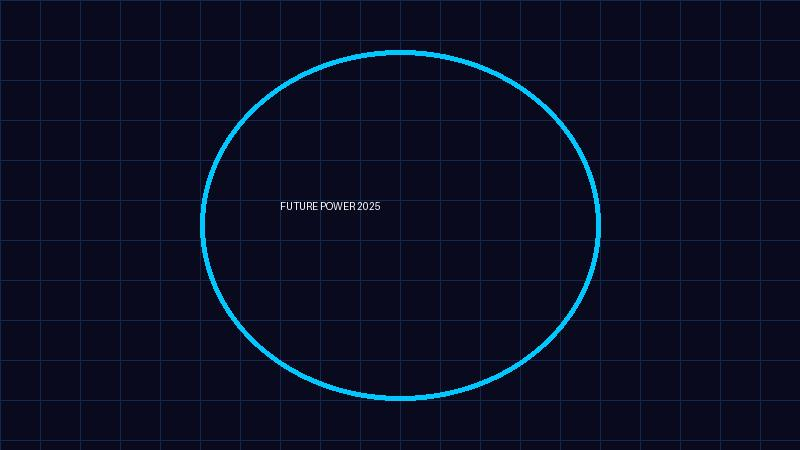

# AI 시대의 핵심 인프라: 2024-2025 전력 산업 트렌드 및 에너지 안보 보고서

## 1. 개요 (Executive Summary)
인공지능(AI)과 첨단 반도체 산업의 급격한 성장은 단순히 소프트웨어의 발전을 넘어, 전 세계적인 전력 수요의 폭발적인 증가를 야기하고 있습니다. 본 리포트에서는 2024년부터 2025년까지의 전력 산업 핵심 트렌드를 분석하고, 대한민국을 포함한 글로벌 전력 수급 현황 및 미래 대응 전략을 진단합니다.

## 2. 전력 산업 핵심 트렌드 분석

### 2.1 AI 및 데이터센터 중심의 수요 급증
AI 모델의 고도화와 데이터센터 증설은 전력 수요의 패러다임을 변화시키고 있습니다. 2024-2025년 글로벌 전력 수요는 약 4%대의 견조한 성장세가 전망되며, 이는 과거의 완만한 증가 곡선을 상회하는 수치입니다. 전력은 이제 단순한 유틸리티를 넘어 '국가 경쟁력의 핵심'으로 자리 잡았습니다.

### 2.2 무탄소 전원(CFS)으로의 에너지 전환 가속화
탄소중립(Net Zero) 달성을 위해 원자력과 재생에너지의 전략적 조합이 강조되고 있습니다. 2025년은 글로벌 재생에너지 발전량이 석탄 발전량을 추월하는 역사적인 분기점이 될 것으로 예상됩니다. 특히, 에너지 안보를 위한 신규 원전 건설 및 노후 원전 수명 연장 논의가 전 세계적으로 재점화되고 있습니다.

### 2.3 전력망(Grid) 현대화 및 인프라 투자
발전량의 증가만큼 중요한 것은 이를 효율적으로 전달하는 '전력망'입니다. 한국 정부는 제11차 전력수급기본계획에 따라 2038년까지 약 72.8조 원을 투입하여 송전선로를 72% 증설할 계획입니다. 이는 분산에너지 활성화와 계통 연계 안정성을 확보하기 위한 필수적인 조치입니다.

## 3. 전력 수급 현황 및 전망

### 3.1 국내 수급 현황
- **수요 전망**: 2025년 국내 전력 수요는 약 549.4 TWh로, 전년 대비 1.9% 증가할 것으로 보입니다.
- **발전 구성 변화**: 2038년까지 무탄소 발전 비중을 70% 이상으로 확대하는 로드맵이 가동 중이며, 노후 석탄 발전소의 LNG 및 무탄소 전원 전환이 가속화되고 있습니다.

### 3.2 글로벌 수급 현황
- 중국과 인도 등 신흥 경제국의 석탄 사용 비중이 여전히 높으나, 재생에너지로의 전환 속도 또한 빠릅니다. 
- 재생에너지의 간헐성을 보완하기 위한 **에너지 저장 시스템(ESS)** 및 **그린수소** 기술이 시장의 신성장 동력으로 강력하게 부상하고 있습니다.

## 4. 결론 및 시사점
AI 시대로의 진입은 전력의 안정적 공급이 곧 기술 패권과 직결됨을 시사합니다. 전력 산업은 단순히 에너지를 공급하는 역할을 넘어, ESS, 수소 경제, 스마트 그리드 등 고부가가치 기술 산업으로 재편되고 있습니다. 기업과 정부는 전력 안보를 최우선 과제로 설정하고, 인프라 확충과 제도적 개선(분산에너지 활성화 등)에 역량을 집중해야 할 시점입니다.

---
**Reference**: `search.md` 기반 데이터 분석 리포트
**Copyright**: 2026 Gemini AI Automation System.
